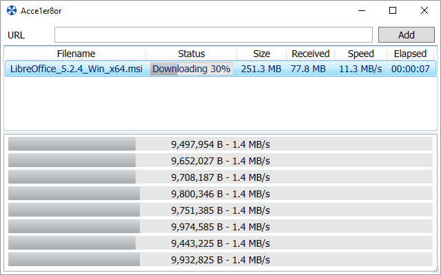

Acce1er8or Download Manager is a download manager and accelerator for Windows. It can increase the speed of downloads by up to 8 times depending on the speed of the internet connection and end-point.

## Installation
* Install `Acce1er8or Download Manager` from the [Chrome Web Store](https://chrome.google.com/webstore/detail/acce1er8or-download-manag/ichjocgihgmpifnjpdhkfndofnhnbkmn)
* Rebuild `desktop-client` with Visual Studio 2015+ (optional)
* Alternatively, download the latest release of the `desktop-cilent` from [Github](https://github.com/nicolasjinchereau/acce1er8or)
* Run `Acce1er8or.exe` at least once to register it's location with Chrome

